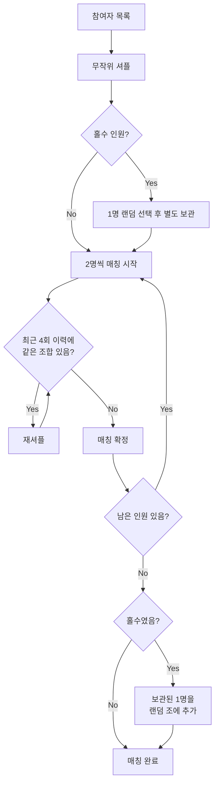

# Coffee Chat ☕

디스코드 서버에서 커피챗 참여자를 자동으로 매칭해주는 봇입니다.

## 기능

- Discord Role 기반 참여자 자동 조회
- 중복 방지 알고리즘으로 매칭 생성 (최근 4회 이력 확인)
- Discord Webhook으로 매칭 결과 발표
- GitHub Actions를 통한 격주 자동 실행
- 매칭 이력 자동 PR 생성

## 설치 방법

### 1. Bun 설치

```bash
curl -fsSL https://bun.sh/install | bash
```

### 2. 의존성 설치

```bash
bun install
```

## 환경변수 설정

| 환경변수 | 설명 | 타입 |
|---------|------|------|
| `DISCORD_BOT_TOKEN` | Discord Bot 토큰 | Secret |
| `DISCORD_WEBHOOK_URL` | Discord Webhook URL | Secret |
| `DISCORD_SERVER_ID` | Discord 서버(Guild) ID | Variable |
| `DISCORD_ROLE_ID` | 커피챗 참여자 Role ID | Variable |

### GitHub Actions 설정

1. Repository Settings > Secrets and variables > Actions
2. **Secrets** 탭에서 추가:
   - `DISCORD_BOT_TOKEN`
   - `DISCORD_WEBHOOK_URL`
3. **Variables** 탭에서 추가:
   - `DISCORD_SERVER_ID`
   - `DISCORD_ROLE_ID`

## Discord 봇 & Webhook 설정

### Bot 생성

1. [Discord Developer Portal](https://discord.com/developers/applications) 접속
2. "New Application" 클릭하여 앱 생성
3. Bot 메뉴에서 "Add Bot" 클릭
4. "Reset Token"으로 토큰 발급 → `DISCORD_BOT_TOKEN`으로 사용

### Bot 권한 설정

1. Bot 메뉴 > Privileged Gateway Intents
2. **SERVER MEMBERS INTENT** 활성화 (필수)
3. OAuth2 > URL Generator에서 권한 설정:
   - Scopes: `bot`
   - Bot Permissions: `Read Messages/View Channels`
4. 생성된 URL로 서버에 봇 초대

### Webhook 생성

1. Discord 서버 > 채널 설정 > 연동
2. "웹후크 만들기" 클릭
3. Webhook URL 복사 → `DISCORD_WEBHOOK_URL`로 사용

### ID 확인 방법

1. Discord 설정 > 고급 > 개발자 모드 활성화
2. 서버 이름 우클릭 > "서버 ID 복사" → `DISCORD_SERVER_ID`
3. 서버 설정 > 역할 > 역할 우클릭 > "역할 ID 복사" → `DISCORD_ROLE_ID`

## 사용 방법

### 로컬 실행

```bash
# 환경변수 설정 후
export DISCORD_BOT_TOKEN="your-token"
export DISCORD_WEBHOOK_URL="your-webhook-url"
export DISCORD_SERVER_ID="your-server-id"
export DISCORD_ROLE_ID="your-role-id"

# 매칭 실행
bun run match
```

### GitHub Actions 자동 실행

- **스케줄**: 매주 월요일 UTC 00:00 (KST 09:00)
- **격주 실행**: 짝수 주차에만 실행
- 수동 실행 시에는 주차 상관없이 실행

### 수동 실행

```bash
# GitHub CLI 사용
gh workflow run match.yml

# 또는 GitHub 웹에서
# Actions > Coffee Chat Matching > Run workflow
```

## 실행 흐름

1. Discord API로 Role 기반 참여자 조회
2. 매칭 이력 로드 (`data/history.json`)
3. 중복 방지 알고리즘으로 매칭 생성
4. `history.json`에 새 매칭 저장
5. Discord Webhook으로 결과 발표
6. 자동 PR 생성 (`chore/update-match-history-YYYY-MM-DD`)

## 매칭 알고리즘

### 핵심 원칙

| 원칙 | 설명 |
|-----|------|
| **2인 1조** | 기본적으로 2명씩 매칭 |
| **중복 방지** | 최근 4회 이력 내 같은 조합 불가 |
| **공정한 무작위** | 모든 참여자에게 동등한 매칭 기회 |

### 매칭 과정



### 예시

**짝수 인원 (6명)**
```
참여자: A, B, C, D, E, F
         ↓ 셔플
결과: [A-D] [B-F] [C-E]
      (2인조 × 3)
```

**홀수 인원 (5명)**
```
참여자: A, B, C, D, E
         ↓ C를 랜덤 선택 후 보관
         ↓ 나머지 4명 매칭
  중간: [A-E] [B-D]
         ↓ C를 랜덤 조에 추가
결과: [A-E-C] [B-D]
      (3인조 × 1, 2인조 × 1)
```

### 중복 방지

최근 **4회** 매칭 이력을 확인하여 같은 조합이 반복되지 않도록 합니다.

```json
// history.json 예시
{
  "matches": [
    { "date": "2024-01-01", "pairs": [["A","B"], ["C","D"]] },
    { "date": "2024-01-15", "pairs": [["A","C"], ["B","D"]] },
    { "date": "2024-01-29", "pairs": [["A","D"], ["B","C"]] },
    { "date": "2024-02-12", "pairs": [["A","B"], ["C","D"]] }
  ]
}
```

위 이력 기준:
- 불가능한 조합: `A-B`, `C-D`, `A-C`, `B-D`, `A-D`, `B-C`
- 4회 이전 이력은 다시 매칭 가능

## 개발

```bash
# 테스트 실행
bun test

# 린트 검사
bun run lint

# 포맷팅
bun run format

# 타입 체크
bun run typecheck
```

## 라이선스

MIT
