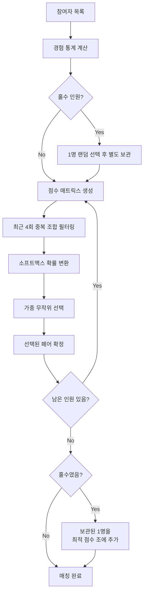

# Coffee Chat ☕

디스코드 서버에서 커피챗 참여자를 자동으로 매칭해주는 봇입니다.

## 기능

- `/coffee join` / `/coffee leave` 슬래시 명령어로 참여/탈퇴
- Discord Role 기반 참여자 자동 조회
- 중복 방지 알고리즘으로 매칭 생성 (최근 4회 이력 확인)
- Discord Bot API로 매칭 결과 발표
- GitHub Actions를 통한 격주 자동 실행
- 매칭 이력 자동 PR 생성

## 설치 방법

### 1. Bun 설치

```bash
curl -fsSL https://bun.sh/install | bash
```

### 2. 의존성 설치

```bash
bun install
```

## 환경변수 설정

| 환경변수 | 설명 | 타입 |
|---------|------|------|
| `DISCORD_BOT_TOKEN` | Discord Bot 토큰 | Secret |
| `DISCORD_SERVER_ID` | Discord 서버(Guild) ID | Variable |

> 매칭 결과를 발표할 채널 ID와 참여자 Role ID는 `data/roles.json`에서 관리합니다.

### GitHub Actions 설정

1. Repository Settings > Secrets and variables > Actions
2. **Secrets** 탭에서 추가:
   - `DISCORD_BOT_TOKEN`
3. **Variables** 탭에서 추가:
   - `DISCORD_SERVER_ID`

## Discord 봇 설정

### Bot 생성

1. [Discord Developer Portal](https://discord.com/developers/applications) 접속
2. "New Application" 클릭하여 앱 생성
3. Bot 메뉴에서 "Add Bot" 클릭
4. "Reset Token"으로 토큰 발급 → `DISCORD_BOT_TOKEN`으로 사용

### Bot 권한 설정

1. Bot 메뉴 > Privileged Gateway Intents
2. **SERVER MEMBERS INTENT** 활성화 (필수)
3. OAuth2 > URL Generator에서 권한 설정:
   - Scopes: `bot`, `applications.commands`
   - Bot Permissions: `Read Messages/View Channels`, `Send Messages`, `Manage Roles`
4. 생성된 URL로 서버에 봇 초대
5. **중요**: 서버 설정 > 역할에서 봇 역할이 커피챗 Role보다 **위에** 위치해야 합니다

### Interactions Endpoint URL 설정

슬래시 명령어(`/coffee join`, `/coffee leave`)를 사용하려면 Worker 배포 후 Endpoint URL을 등록해야 합니다.

1. [Discord Developer Portal](https://discord.com/developers/applications) → 앱 선택
2. General Information → **Interactions Endpoint URL**에 Worker URL 입력
3. "Save Changes" 클릭 (Discord가 자동으로 PING 검증을 수행)

> 현재 URL: `https://coffee.dalestudy.workers.dev`

### ID 확인 방법

1. Discord 설정 > 고급 > 개발자 모드 활성화
2. 서버 이름 우클릭 > "서버 ID 복사" → `DISCORD_SERVER_ID`
3. 서버 설정 > 역할 > 역할 우클릭 > "역할 ID 복사" → `DISCORD_ROLE_ID`

## 사용 방법

### 로컬 실행

```bash
# 환경변수 설정 후
export DISCORD_BOT_TOKEN="your-token"
export DISCORD_SERVER_ID="your-server-id"

# 매칭 실행
bun run match
```

### GitHub Actions 자동 실행

- **스케줄**: 매주 월요일 UTC 00:00 (KST 09:00)
- **격주 실행**: 짝수 주차에만 실행
- 수동 실행 시에는 주차 상관없이 실행

### 수동 실행

```bash
# GitHub CLI 사용
gh workflow run match.yml

# 또는 GitHub 웹에서
# Actions > Coffee Chat Matching > Run workflow
```

## 실행 흐름

1. Discord API로 Role 기반 참여자 조회
2. 매칭 이력 로드 (`data/history.json`)
3. 중복 방지 알고리즘으로 매칭 생성
4. `history.json`에 새 매칭 저장
5. Discord Bot API로 결과 발표
6. 자동 PR 생성 (`chore/update-match-history-YYYY-MM-DD`)

## 매칭 알고리즘

### 핵심 원칙

| 원칙 | 설명 |
|-----|------|
| **2인 1조** | 기본적으로 2명씩 매칭 |
| **중복 방지** | 최근 4회 이력 내 같은 조합 불가 |
| **적게 만난 사람 우선** | 과거에 적게 만난 사람일수록 매칭 확률 증가 |
| **경험 믹싱** | 신규 멤버와 경험 많은 멤버가 섞이도록 유도 |

### 점수 기반 매칭

모든 가능한 페어에 대해 점수를 계산하고, 점수가 높을수록 매칭 확률이 높아집니다.

**종합 점수 = 만남 횟수 점수 (60%) + 경험 믹싱 점수 (40%)**

#### 만남 횟수 점수

```
점수 = 1 / (1 + 만남 횟수)
```

| 만남 횟수 | 점수 |
|----------|------|
| 0회 | 1.0 |
| 1회 | 0.5 |
| 2회 | 0.33 |
| 3회 | 0.25 |

#### 경험 믹싱 점수

참여자의 경험 수준을 3단계로 분류합니다:

- **Newcomer**: 하위 25% (참여 횟수 적음)
- **Regular**: 중간 50%
- **Veteran**: 상위 25% (참여 횟수 많음)

| A \ B | Newcomer | Regular | Veteran |
|-------|----------|---------|---------|
| Newcomer | **0.3** | 0.8 | **1.0** |
| Regular | 0.8 | 0.6 | 0.8 |
| Veteran | **1.0** | 0.8 | 0.5 |

→ 신규+신규 = 낮은 점수 (0.3), 신규+베테랑 = 높은 점수 (1.0)

### 매칭 과정



### 예시

**점수 계산 예시**

```
참여자: A(베테랑), B(신규), C(레귤러), D(신규)

A-B 점수: 만남0회(1.0×0.6) + 베테랑-신규(1.0×0.4) = 1.0
A-C 점수: 만남1회(0.5×0.6) + 베테랑-레귤러(0.8×0.4) = 0.62
B-D 점수: 만남0회(1.0×0.6) + 신규-신규(0.3×0.4) = 0.72

→ A-B 매칭 확률이 가장 높음
```

**홀수 인원 (5명)**

```
참여자: A, B, C, D, E
         ↓ E를 랜덤 선택 후 보관
         ↓ 나머지 4명 점수 기반 매칭
  중간: [A-B] [C-D]
         ↓ E를 점수가 가장 높은 조에 추가
결과: [A-B-E] [C-D]
      (3인조 × 1, 2인조 × 1)
```

### 중복 방지

최근 **4회** 매칭 이력을 확인하여 같은 조합이 반복되지 않도록 합니다.

```json
// history.json 예시
{
  "matches": [
    { "date": "2024-01-01", "pairs": [["A","B"], ["C","D"]] },
    { "date": "2024-01-15", "pairs": [["A","C"], ["B","D"]] },
    { "date": "2024-01-29", "pairs": [["A","D"], ["B","C"]] },
    { "date": "2024-02-12", "pairs": [["A","B"], ["C","D"]] }
  ]
}
```

위 이력 기준:

- 불가능한 조합: `A-B`, `C-D`, `A-C`, `B-D`, `A-D`, `B-C`
- 4회 이전 이력은 다시 매칭 가능
- 불가능한 조합이 모두 최근 4회에 포함된 경우, fallback으로 가능한 조합 선택

## 제약사항 및 향후 계획

| 현재 제약사항 | 개선 방향 |
|-------------|----------|
| JSON 파일 기반 저장 (동시성 제어 없음, 스케일링 한계) | PostgreSQL/MongoDB로 마이그레이션 |
| GitHub Actions 실행 (매칭 주기 변경 시 코드 수정 필요) | 설정 관리 시스템 |

## 개발

```bash
# 테스트 실행
bun test

# 린트 검사
bun run lint

# 포맷팅
bun run format

# 타입 체크
bun run typecheck

# Worker 로컬 개발
bun run worker:dev

# Worker 배포
bun run worker:deploy

# 슬래시 명령어 등록
bun run worker:register
```

### Worker 배포 (슬래시 명령어)

`/coffee join`, `/coffee leave` 명령어는 Cloudflare Workers로 처리됩니다.

#### 최초 배포

```bash
# 1. 의존성 설치
cd worker && bun install

# 2. Cloudflare 로그인
bunx wrangler login

# 3. Worker 배포
bunx wrangler deploy

# 4. Bot 토큰 등록 (프롬프트에 토큰 입력)
bunx wrangler secret put DISCORD_BOT_TOKEN

# 5. 슬래시 명령어 등록
bun run register-commands
```

마지막으로 [Discord Developer Portal](https://discord.com/developers/applications) → 앱 선택 → General Information → **Interactions Endpoint URL**에 배포된 URL을 입력합니다.

> 현재 배포 URL: `https://coffee.dalestudy.workers.dev`

#### 멤버 추가 (Cloudflare 계정)

새로운 팀 멤버가 Worker를 배포하거나 관리하려면 Cloudflare 계정에 멤버로 추가해야 합니다.

1. [Cloudflare 대시보드](https://dash.cloudflare.com) 로그인
2. Manage account → Members
3. **Invite** 클릭 → 이메일 주소 입력
4. 역할 선택:
   - **Administrator**: 모든 권한 (배포, secret 관리 등)
   - **Worker Admin**: Worker 관련 권한만

초대받은 멤버는 이메일의 초대 링크를 클릭하여 수락하면 됩니다.

#### 로컬 개발

```bash
cd worker

# .dev.vars 파일에 DISCORD_BOT_TOKEN 설정
echo 'DISCORD_BOT_TOKEN=your-token' > .dev.vars

# 로컬 서버 시작
bun run dev
```

## 라이선스

MIT
